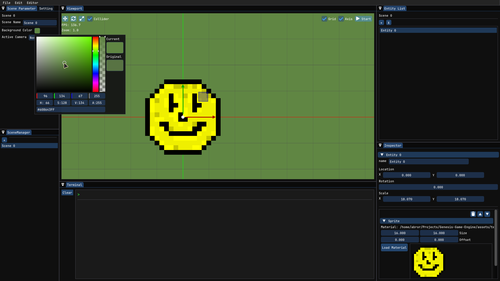
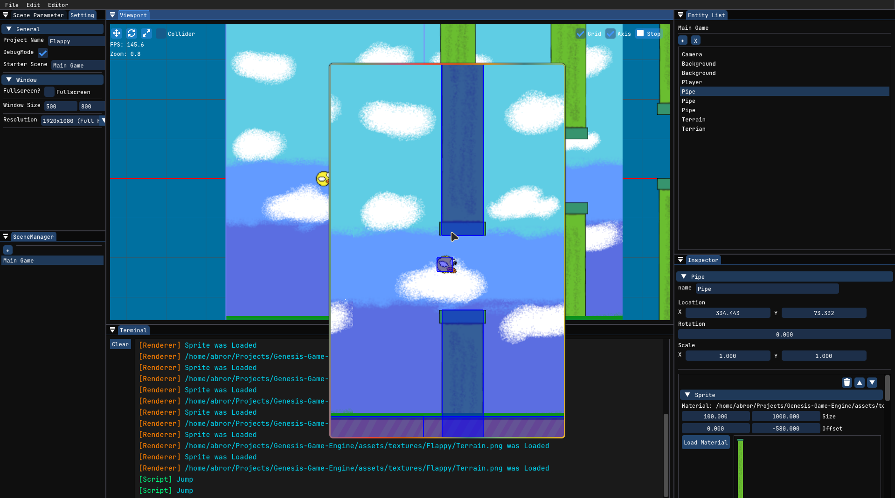
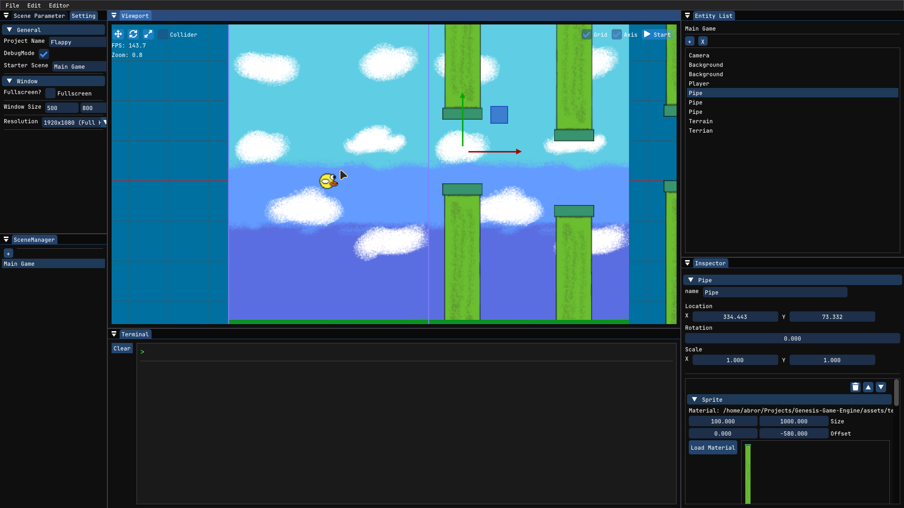

<p align="center">
  
</p>

<h1 align="center">Genesis Game Engine</h1>

<p align="center">
  A custom 2D game engine with an interactive editor, built from scratch in C++17.<br/>
  ECS architecture, Lua scripting, scene management — the works.
</p>

<p align="center">
  <a href="#features">Features</a> &bull;
  <a href="#screenshots">Screenshots</a> &bull;
  <a href="#build">Build</a> &bull;
  <a href="#project-structure">Structure</a> &bull;
  <a href="#tech-stack">Tech</a>
</p>

---

## About

Genesis is a personal game engine project — an editor and runtime for 2D games. It's not a toy demo; it's a real tool with a real editor UI, component inspector, scene management, and Lua scripting. Built as a portfolio piece and a foundation for future games.

The engine uses an **Entity Component System** architecture, where entities are just IDs and behavior lives in components. The editor is built on ImGui with docking, and the whole thing is cross-platform (Linux, Windows, macOS).

Built with [cart](https://github.com/Abrorismoiljanov/cart) — a C++ build tool I also created.

---

## Features

### Editor
- **Dockable UI** — ImGui-based editor with resizable panels, theming, and dark mode
- **Entity Inspector** — select entities in the scene, view and edit all attached components in real-time
- **Scene Management** — create, switch, and configure multiple scenes with dedicated settings
- **Viewport** — live preview with camera controls, grid overlay, and gizmo manipulation (translate/rotate/scale via ImGuizmo)
- **Asset Browser** — file dialogs for loading textures, scripts, and materials with drag-and-drop
- **Terminal Panel** — built-in command system with custom commands
- **Project Settings** — window size, resolution presets, fullscreen toggle

### Engine
- **Entity Component System** — entities are lightweight IDs; components define behavior (Sprite, Camera, Script, Collision)
- **Lua Scripting** — attach Lua scripts to entities via sol2. Scripts get access to the entity's transform and can be edited live
- **Sprite Rendering** — texture-mapped sprites with material support, rendered via OpenGL
- **Camera System** — 2D camera with zoom, used for both editor viewport and runtime rendering
- **Collision Detection** — AABB collision with trigger/static flags and layer masks
- **Asset Pipeline** — texture and material management with GPU upload, handles for serialization
- **Scene Serialization** — save/load entire projects as JSON, including all entities, components, and asset references
- **Portable Saves** — project files use relative paths, so they work across machines and directories

---

## Screenshots

<p align="center">
  
</p>
<p align="center">
  
</p>
<p align="center">
  
</p>

---

## Project Structure

```
Genesis-Game-Engine/
├── Editor/            # Editor application
│   ├── src/           #   Editor source (UI, panels, renderer)
│   └── include/       #   Editor headers
├── Runtime/           # Game runtime (runs without editor)
│   ├── src/           #   Runtime source
│   └── include/       #   Runtime headers
├── DataTypes/         # Shared data structures (headers)
│   ├── Components/    #   Sprite, Camera, Script, Collision components
│   ├── Assets/        #   Texture, Material, Script asset types
│   └── outside/       #   Utilities (FilePaths, ShaderUtils)
├── DataTypesDef/      # Shared implementations
├── Shader/            # GLSL shaders (vertex, fragment, grid, picking)
├── assets/            # Runtime assets (fonts, scripts, textures)
├── vendor/            # Vendored dependencies
│   ├── sol/           #   sol2 (Lua C++ binding)
│   ├── lua/           #   Lua source
│   └── ImGuiFileDialog/
├── cart.toml          # Build configuration
└── README.md
```

---

## Tech Stack

| Library | Purpose |
|---------|---------|
| [SDL2](https://www.libsdl.org/) | Window management, input, platform abstraction |
| [OpenGL](https://www.opengl.org/) | Graphics rendering |
| [GLEW](https://glew.sourceforge.net/) | OpenGL extension loading |
| [ImGui](https://github.com/ocornut/imgui) (docking) | Editor UI |
| [ImGuizmo](https://github.com/CedricGuillemet/ImGuizmo) | Transform gizmos |
| [sol2](https://github.com/ThePhD/sol2) | Lua C++ bindings |
| [Lua](https://www.lua.org/) | Scripting runtime |
| [nlohmann/json](https://github.com/nlohmann/json) | JSON serialization |
| [stb_image](https://github.com/nothings/stb) | Image loading |

**Build tool:** [cart](https://github.com/Abrorismoiljanov/cart) — a zero-config C++ build tool and package manager. Think `cargo` but for C++.

---

## Build

### Prerequisites

- C++17 compiler (GCC 9+, Clang 10+, or MSVC 2019+)
- SDL2, OpenGL, GLEW (system packages)
- [cart](https://github.com/Abrorismoiljanov/cart) (`cargo install cart`)

### Linux (Arch/Manjaro)

```bash
sudo pacman -S sdl2 glew glm nlohmann-json
```

### Linux (Ubuntu/Debian)

```bash
sudo apt install libsdl2-dev libglew-dev libglm-dev nlohmann-json3-dev
```

### Windows

Install via [vcpkg](https://vcpkg.io/) or [MSYS2](https://www.msys2.org/):

```bash
# vcpkg
vcpkg install sdl2 glew glm nlohmann-json

# MSYS2
pacman -S mingw-w64-x86_64-sdl2 mingw-w64-x86_64-glew mingw-w64-x86_64-glm mingw-w64-x86_64-nlohmann-json
```

### macOS

```bash
brew install sdl2 glew glm nlohmann-json
```

### Build & Run

```bash
git clone https://github.com/Abrorismoiljanov/Genesis-Game-Engine
cd Genesis-Game-Engine
cart build
./build/genesis
```

---

## How It Works

1. The **Editor** launches a window via SDL2, initializes OpenGL, and sets up ImGui
2. You create **Entities** in the scene, add **Components** (Sprite, Camera, Script, Collision) via the Inspector
3. **Scripts** are Lua files attached to entities — they run every frame and can access the entity's transform
4. The **Renderer** draws all sprites with OpenGL shaders, handles camera transforms, and renders the grid overlay
5. **Save/Load** serializes the entire project state to JSON with relative paths, so projects are portable

---

## License

MIT

---

<p align="center">
  Built by <a href="https://github.com/Abrorismoiljanov">Abrorismoiljanov</a>
</p>
