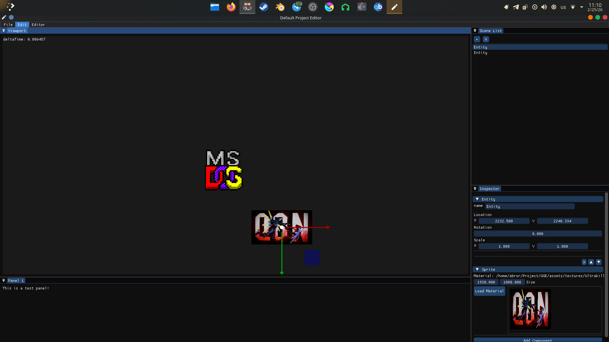
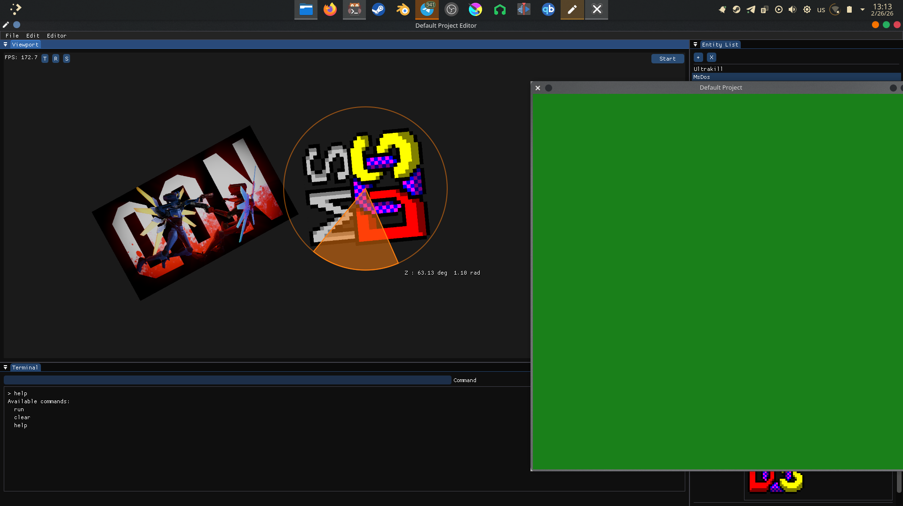
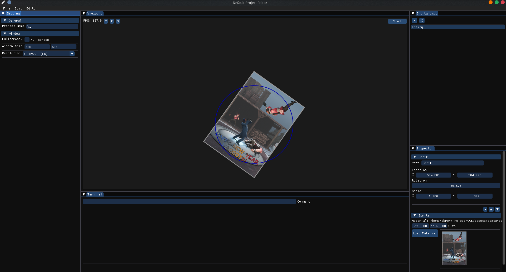

# MyGameEditor

A lightweight C++ game engine editor built with SDL2, OpenGL, ImGui, and Assimp.  
Designed to manage **Scenes**, **Entities**, and **Components** with a flexible editor UI.

---

## Features

- **Entity-Component System**  
  - Add, remove, and reorder components.
  - Inspect and modify components in the editor.
- **Scene Management**  
  - Multiple scenes support.
  - Drag-and-drop entity ordering.
- **ImGui-based Editor**  
  - Component inspector with collapsing headers and UI controls.
  - File dialog support for importing meshes.
---

## Screenshots




### Prerequisites

- C++17 compatible compiler  
- [SDL2](https://www.libsdl.org/)  
- [OpenGL](https://www.opengl.org/)  
- [ImGui](https://github.com/ocornut/imgui)  
- [xmake](https://xmake.io/#/) (build system)

### Build

Clone the repository:

```bash
git clone git@github.com:username/MyGameEditor.git
cd GGE
